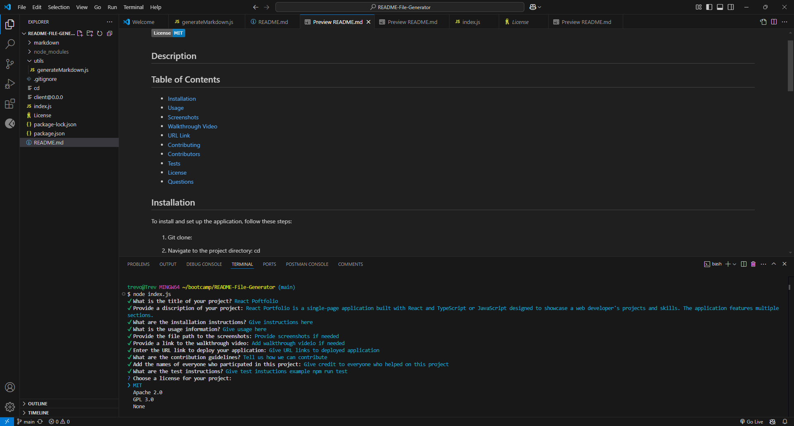

# README File Generator
  

  ## Description
  The README File Generator is a command-line application that useses node.js to help developers quickly create professional README files for their projects. By prompting you with a series of questions using the inquirer package about your project details, such as the installation, usage, technologies, screenshots, walkthrough video, UR link, contributiong, contributors, test, license and questions are used to automatically compiles this information into a well-structured README. This not only saves time but also ensures that your project documentation is consistent and informative, making it easier for others to understand and contribute to your work.

  ## Table of Contents
  - [Installation](#installation)
  - [Usage](#usage)
  - [Technologies](#technologies)
  - [Screenshots](#screenshots)
  - [Walkthrough Video](#walkthrough-video)
  - [URL Link](#url-link)
  - [Contributing](#contributing)
  - [Contributors](#contributors)
  - [Tests](#tests)
  - [License](#license)
  - [Questions](#questions)

  ## Installation
  
  1. Git clone: git@github.com:Treevyy/README-File-Generator.git

  2. Navigate to the project directory: cd README-File-Generator

  3. Right click the root package.json file and click open in integrated terminal

  4. Inside the terminal install the dependencies with the command: npm i

  5. After dependencies are installed run the application with the command: node index.js

  ## Usage
  To generate your README file:

  1. Run the application using node index.js in your terminal.

  2. Answer the interactive prompts with details about your project, such as the project title, description, installation process, usage guidelines, and any additional information you wish to include.

  3. Once all prompts are completed, the generator will create a new README file in your project directory.

  4. Open and review the generated README to ensure it meets your expectations and make any custom edits if necessary.

  ## Technologies
 

 

 

  ## Screenshots
  
  

  ## Walkthrough Video
  A demo of the application can be found at the following link: https://drive.google.com/file/d/1ypGWTxIBea_0EZGGuwxYkWO1SCozieXw/view

  ## URL Link
  There is no URL link to this application
  
  ## Contributing
  No contributions are needed for this project

  ## Contributors
  Trevor Moore aka Treevyy

  ## Tests
  Make sure the latest version of node is installed, check by using the command: node -v in your terminal

  Then run the command: node index.js inside the terminal to test the application

  ## License
  This project is licensed under the MIT license.

  ## Questions
  If you have any additonal questions, you can contact me at:
  - GitHub: [Treevyy](https://github.com/Treevyy)
  - Email: [aarontrevormoore@gmail.com](mailto:aarontrevormoore@gmail.com)
